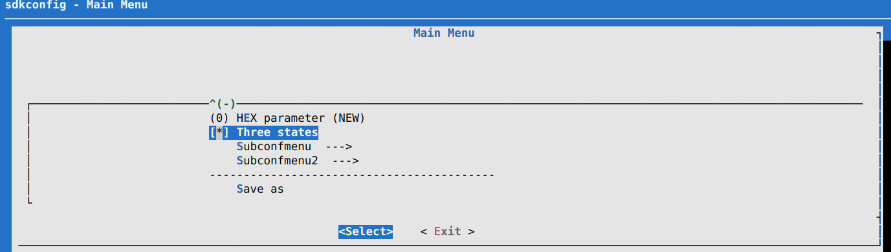

menuconfig
==========

在 linux kernel 源码中的 mconf 工具, 简单改造而来. 用于图形化生成项目宏配置.

## TODO

* [ ] 配置文件中文展示乱码

## 编译安装

sh install.sh

## 测试

`mconf test/rootconf`

将弹出如下 CLI 界面



## 读取宏配置

以下是写好的读取宏配置 cmake 配置

```cmake
# 读取文件内容
file(STRINGS sdkconfig lines NEWLINE_CONSUME)
# message(kconfig=${lines})


message("==========================读取配置文件==========================")

string(REGEX MATCHALL "(CONFIG[a-zA-Z_0-9]+)=([a-zA-Z0-9\"]+)" result ${lines})
message(${result})

message("==========================读取完毕,解析...==========================")

set(MATCHED_LINES "")
set(FLAGS "")
# 迭代处理每一行
foreach(line ${result})
    list(APPEND MATCHED_LINES ${line})
    # add_compile_definitions(${line})
    # string(REGEX MATCH "([a-zA-Z_0-9\"]+)" p ${line})
    string(REPLACE "\n" ";" pv ${line})
    string(REPLACE "=" ";" pv ${line})
    list(GET pv 0 p)
    list(GET pv 1 v)

    string(COMPARE EQUAL ${v} y equal)
    if(${equal})
        message(NOTICE ${p} \t\t ==> \t [选项是 y] \t ==> -D${p})
        add_compile_definitions(${p})
        set(${p} 1)
    else()
        message(NOTICE ${p} \t\t ==> \t [选项是 ${v}] \t ==> -D${line})
        add_compile_definitions(${line})
        set(${p} ${v})
    endif()
endforeach()

message("==========================配置文件解析完毕==========================")

```
